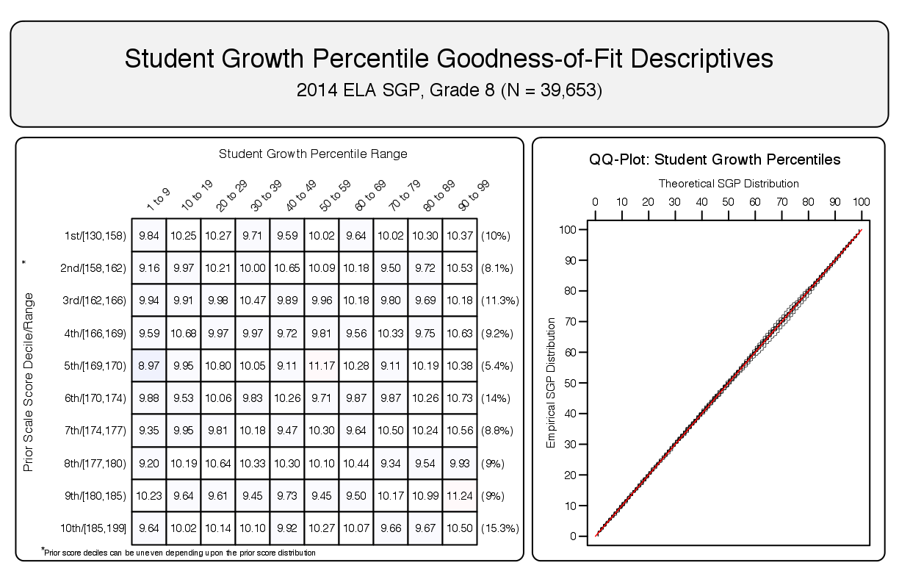
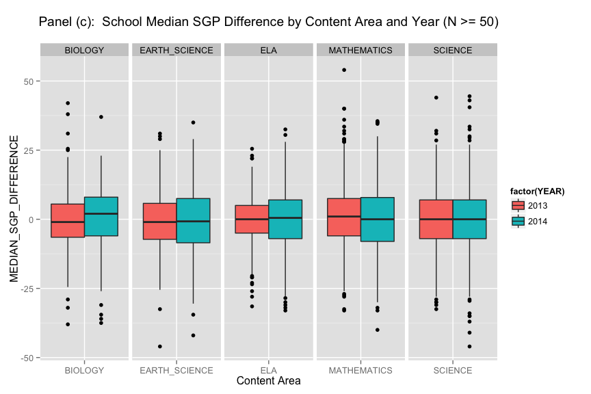

<!--SGPreport-->

```{r, echo=FALSE, include=FALSE}
  require(SGP)
  require(Gmisc)
	require(ggplot2)

  ## set a universal Cache path
  knitr::opts_chunk$set(cache.path = "_cache/Appendix_C", fig.path="../img/Appendices/Appendix_C/")

  ##  Set Table, Figure and Equation Counters
  options(table_counter=FALSE)
  options(table_number=0)
  options(table_counter_str = "<strong>Table C.%s:</strong> ")
  options("fig_caption_no"=0)
  options(fig_caption_no_sprintf = "**Fig. C.%s:**   %s")
  options("fig_caption_no_roman"=FALSE)
	options("equation_counter" = 0)
	
	subject_order<-c("ELA", "MATHEMATICS", "SCIENCE", 
									 "EARTH_SCIENCE", "BIOLOGY", "CHEMISTRY", "PHYSICS")
	GL_subjects <- c("ELA", "MATHEMATICS", "SCIENCE")
	EOCT_subjects<-c("EARTH_SCIENCE", "BIOLOGY", "CHEMISTRY", "PHYSICS")
```


# Introduction
In the 2013-2014 academic year, Utah transitioned from its previous Utah Criterion Referenced Tests (CRT) to the [Student Assessment of Growth and Excellence (SAGE)](http://www.schools.utah.gov/assessment/SAGE.aspx). The transition included numerous changes to the assessment system including the incorporation of new performance standards and moving to a vertical scale. The Utah SOE’s goal was to maintain SGP analyses across this transition. Based upon research and recommendations from the NCIEA, the calculation of SGPs across this transition was not likely to be problematic:

1. The current and previous assessments did not demonstrate pronounced floor or ceilings with large (>5%) of students obtaining the LOSS/HOSS.
2. The current and previous assessments would likely show similar correlations between current and prior scores seen on previous assessments. 

Following SGP analysis of SAGE data using CRT data as priors, schools reported anomalies and this led to a larger investigation of results. The anomalies centered around deviations from previous results leading to questions about whether the SGPs calculated across the transition were valid.

Utah SOE asked the NCIEA to investigate further the validity of the SGP calculations. Validation began by looking at the two items mentioned above, and also included an investigation of the annual relationship of school-level median SGPs.

<!-- HTML_Start -->
<!-- LaTeX_Start 
\pagebreak
LaTeX_End -->

# Ceiling/Floor Effects

The goodness of fit plots provided in the 2014 analyses confirm that no ceiling/floor effects were present that might distort the SGP analyses.  All fit plots for the 2014 SGP analyses can be found in Appendix A of the 2014 Utah Growth Model Report.  As an example, Figure `r paste("C", getOption("fig_caption_no")+1, sep=".")`  shows the results for 8<sup>th</sup> grade ELA.  Evidence of ceiling and floor effects would appear as inordinate numbers of high or low SGPs at the extremes of the prior scale scores.  However, all analyses demonstrate a uniform distribution of SGPs as expected.

##### `r figCapNo("Goodness of Fit Plot for 2014 8<sup>th</sup> Grade ELA.")`


<!-- HTML_Start -->
<!-- LaTeX_Start 
\pagebreak
LaTeX_End -->

# Test Score Correlations
Correlations between student level current and prior achievement scale scores were all high and similar to correlations seen previously between CRT administration.  The correlations between these dependent and independent variables used in the regression analyses for 2011 - 2014 are shown in Tables `r tblNumNext()` and `r tblNumNext()+1`, and are highly similar before and after the assessment transition.

```{r, cache=TRUE, include=FALSE, echo=FALSE, corTab}
	cor_tbl <- Utah_SGP@Data[!is.na(GRADE) & !is.na(CONTENT_AREA) & !is.na(SGP) & !CONTENT_AREA %in% c("SEC_MATH_I", "SEC_MATH_II", "SEC_MATH_III", "ALGEBRA_I", "ALGEBRA_II", "GEOMETRY", "PRE_ALGEBRA"), list("Correlation"=round(cor(SCALE_SCORE, SCALE_SCORE_PRIOR, use="complete.obs"), 2)), keyby=list(CONTENT_AREA, GRADE, YEAR)]
	cor_tbl <- dcast(cor_tbl[-which(CONTENT_AREA=="MATHEMATICS" & GRADE==8)], formula = CONTENT_AREA + GRADE ~ YEAR, value.var="Correlation")
```
```{r, results='asis', echo=FALSE, corTab_GL}
	gl_cor_tbl <- cor_tbl[CONTENT_AREA %in% GL_subjects]
	gl_cor_tbl[, GRADE := as.numeric(GRADE)]
	setkey(gl_cor_tbl)
	gl_cor_tbl$CONTENT_AREA <- sapply(gl_cor_tbl$CONTENT_AREA, capwords)
	gl_cor_tbl$CONTENT_AREA[duplicated(gl_cor_tbl$CONTENT_AREA)] <- ""
	setnames(gl_cor_tbl, sapply(names(gl_cor_tbl), capwords))

  cat(dualTable(as.matrix(gl_cor_tbl), align=paste(rep('r', dim(gl_cor_tbl)[2]), collapse=''), 
  	n.cgroup=c(2, dim(gl_cor_tbl)[2]-2), cgroup=c("", "Academic Year"),
		caption='Grade-Level CRT and SAGE Correlations'))
```

```{r, results='asis', echo=FALSE, corTab_EOCT}
	eoct_cor_tbl <- cor_tbl[CONTENT_AREA %in% EOCT_subjects]
  eoct_cor_tbl[, GRADE := NULL]
  eoct_cor_tbl$CONTENT_AREA <- sapply(eoct_cor_tbl$CONTENT_AREA, capwords)
	setnames(eoct_cor_tbl, sapply(names(eoct_cor_tbl), capwords))

  cat(dualTable(as.matrix(eoct_cor_tbl), align=paste(rep('r', dim(eoct_cor_tbl)[2]), collapse=''), 
  	n.cgroup=c(1, dim(eoct_cor_tbl)[2]-1), cgroup=c("", "Academic Year"),
		caption='EOCT Subject Correlations Before and After SAGE Transition.'))
```

# School-Level Median SGPs
Because SGP analyses done in Utah are cohort referenced, the median SGP by norm group will always be 50. For each school demonstrating a drop from year to year with respect to their median SGP there will be a commensurate increase. Thus, anomalies reported with drops would necessarily be balanced by others going up. This can be see in the box plots of Figure `r paste("C", getOption("fig_caption_no")+1, sep=".")`. Across all the content areas, the difference in school level median SGP from this year (SAGE) to last (CRT) are centered around 0 with some schools demonstrating increases and some decreases. Filtering out schools with medians based upon more than 20 or 50 students (panels (b) and (c) of Figure `r paste("C", getOption("fig_caption_no")+1, sep=".")` respectively) removes schools with large differences but with the overall pattern remaining of symmetry around zero in terms of increases/decreases.

```{r, cache=TRUE, echo=FALSE, include=FALSE}
	### Reshape data
	
	Utah_School_Content_Area_Wide_Data <- 
		reshape(Utah_SGP@Summary$SCHOOL_NUMBER[[4]][SCHOOL_ENROLLMENT_STATUS=="Enrolled School: Yes" & YEAR %in% c("2012", "2013", "2014") & CONTENT_AREA %in% c("BIOLOGY", "EARTH_SCIENCE", "ELA", "MATHEMATICS", "SCIENCE")], idvar=c("SCHOOL_NUMBER", "CONTENT_AREA"), timevar="YEAR", direction="wide")
	Utah_School_Content_Area_Wide_Data$MEDIAN_SGP_DIFF_2013_2014 <- Utah_School_Content_Area_Wide_Data$MEDIAN_SGP.2014 - Utah_School_Content_Area_Wide_Data$MEDIAN_SGP.2013
	Utah_School_Content_Area_Wide_Data$MEDIAN_SGP_DIFF_2012_2013 <- Utah_School_Content_Area_Wide_Data$MEDIAN_SGP.2013 - Utah_School_Content_Area_Wide_Data$MEDIAN_SGP.2012
	
	Utah_School_Content_Area_Year_Data <- data.table(
						SCHOOL_NUMBER=rep(Utah_School_Content_Area_Wide_Data$SCHOOL_NUMBER, 2),
						CONTENT_AREA=rep(Utah_School_Content_Area_Wide_Data$CONTENT_AREA, 2),
						YEAR=rep(2013:2014, each=dim(Utah_School_Content_Area_Wide_Data)[1]),
						MEDIAN_SGP_DIFFERENCE=c(Utah_School_Content_Area_Wide_Data$MEDIAN_SGP_DIFF_2012_2013, Utah_School_Content_Area_Wide_Data$MEDIAN_SGP_DIFF_2013_2014),
						MEDIAN_SGP_DIFFERENCE_COUNT=c(Utah_School_Content_Area_Wide_Data$MEDIAN_SGP_COUNT.2013, Utah_School_Content_Area_Wide_Data$MEDIAN_SGP_COUNT.2014))
	
	Utah_School_Content_Area_Year_Data <- subset(Utah_School_Content_Area_Year_Data, !is.na(MEDIAN_SGP_DIFFERENCE))
	
	Utah_School_Content_Area_Year_Data_NO_SMALL <- subset(Utah_School_Content_Area_Year_Data, MEDIAN_SGP_DIFFERENCE_COUNT>=20)
	Utah_School_Content_Area_Year_Data_BIG <- subset(Utah_School_Content_Area_Year_Data, MEDIAN_SGP_DIFFERENCE_COUNT>=50)

```

```{r, echo=FALSE, include=FALSE, cache=TRUE, Boxplot_MSGP_by_Year, fig.height=6, fig.width=9}
	ggplot(aes(x=CONTENT_AREA, y=MEDIAN_SGP_DIFFERENCE, fill=factor(YEAR)), data=Utah_School_Content_Area_Year_Data) + geom_boxplot() + facet_grid(.~CONTENT_AREA, scales="free") + labs(x="Content Area") + ggtitle('Panel (a):  School Median SGP Difference by Content Area and Year\n')

```

```{r, echo=FALSE, include=FALSE, cache=TRUE, Boxplot_MSGP_by_Year20, fig.height=6, fig.width=9}
	ggplot(aes(x=CONTENT_AREA, y=MEDIAN_SGP_DIFFERENCE, fill=factor(YEAR)), data=Utah_School_Content_Area_Year_Data_NO_SMALL)+geom_boxplot()+facet_grid(.~CONTENT_AREA, scales="free") + labs(x="Content Area") + ggtitle('Panel (b):  School Median SGP Difference by Content Area and Year (N >= 20)\n')

```

```{r, echo=FALSE, include=FALSE, cache=TRUE, Boxplot_MSGP_by_Year50, fig.height=6, fig.width=9}
	ggplot(aes(x=CONTENT_AREA, y=MEDIAN_SGP_DIFFERENCE, fill=factor(YEAR)), data=Utah_School_Content_Area_Year_Data_BIG)+geom_boxplot()+facet_grid(.~CONTENT_AREA, scales="free") + labs(x="Content Area") + ggtitle('Panel (c):  School Median SGP Difference by Content Area and Year (N >= 50)\n')

```

<!-- HTML_Start -->

##### `r figCapNo("Median SGP by Year and Content Area.")` 





<!-- LaTeX_Start 
\begin{figure}[H]
\caption*{\label{fig:Bidensity} {\bf{Fig. C.2:}} Median SGP by Year and Content Area.}
  \begin{subfigure}[b]{\textwidth}
    \includegraphics[width=\textwidth]{../img/Appendices/Appendix_C/Boxplot_MSGP_by_Year-1.png}
  \end{subfigure}
\end{figure}

\pagebreak

\begin{figure}[H]
  \begin{subfigure}[b]{\textwidth}
    \includegraphics[width=\textwidth]{../img/Appendices/Appendix_C/Boxplot_MSGP_by_Year20-1.png}
  \end{subfigure}
  %
  \begin{subfigure}[b]{\textwidth}
    \includegraphics[width=\textwidth]{../img/Appendices/Appendix_C/Boxplot_MSGP_by_Year50-1.png}
  \end{subfigure}
\end{figure}

LaTeX_End -->

The bubblePlots shown in Figures `r paste("C", getOption("fig_caption_no")+1, sep=".")` and `r paste("C", getOption("fig_caption_no")+2, sep=".")` show the 2013 school median SGP versus the 2014 school median SGP. Bubbles in the upper left/lower right of the charts correspond to those with larger differences. 

```{r, cache=TRUE, echo=FALSE, include=FALSE}
	### Reshape data
	
	Utah_School_Content_Area_Wide_Data <- 
		reshape(Utah_SGP@Summary$SCHOOL_NUMBER[[4]][SCHOOL_ENROLLMENT_STATUS=="Enrolled School: Yes"], 
						idvar=c("SCHOOL_NUMBER", "CONTENT_AREA"), timevar="YEAR", direction="wide")
	
	Utah_School_Content_Area_Wide_Data$MEDIAN_SGP_DIFF_2014_2013 <- Utah_School_Content_Area_Wide_Data$MEDIAN_SGP.2014 - Utah_School_Content_Area_Wide_Data$MEDIAN_SGP.2013
	Utah_School_Content_Area_Wide_Data_NO_SMALL <- subset(Utah_School_Content_Area_Wide_Data, MEDIAN_SGP_COUNT.2014 >= 20 & MEDIAN_SGP_COUNT.2013 >= 20)
	Utah_School_Content_Area_Wide_Data_BIG <- subset(Utah_School_Content_Area_Wide_Data, MEDIAN_SGP_COUNT.2014 >= 20 & MEDIAN_SGP_COUNT.2013 >= 100)
	
	Utah_School_Content_Area_Grade_Wide_Data <- 
		reshape(Utah_SGP@Summary$SCHOOL_NUMBER[[8]][SCHOOL_ENROLLMENT_STATUS=="Enrolled School: Yes"], idvar=c("SCHOOL_NUMBER", "CONTENT_AREA", "GRADE"), timevar="YEAR", direction="wide")
	
	Utah_School_Content_Area_Grade_Wide_Data$MEDIAN_SGP_DIFF_2014_2013 <- Utah_School_Content_Area_Grade_Wide_Data$MEDIAN_SGP.2014 - Utah_School_Content_Area_Grade_Wide_Data$MEDIAN_SGP.2013
	
```

```{r, cache=TRUE, results='asis', echo=FALSE, include=FALSE, BubblePlot_MSGP_by_Year}
########################################################################################
###
### Create bubblePlot of 2013 versus 2014 median SGP for each relevant content area
###
########################################################################################


horizontal.base.line <- c("grid.lines(x=c(0.03, 0.97), y=unit(50, 'native'), gp=gpar(col='grey40', lwd=1.25, lty=2, alpha=0.5))",
				"grid.lines(x=unit(50, 'native'), y=c(0.03, 0.97), gp=gpar(col='grey40', lwd=1.25, lty=2, alpha=0.5))")

for (i in setdiff(unique(Utah_School_Content_Area_Wide_Data_BIG$CONTENT_AREA), NA)) {
bubble.plot.data <- subset(Utah_School_Content_Area_Wide_Data_BIG, CONTENT_AREA==i)

bubblePlot(
        bubble_plot_data.X=bubble.plot.data[["MEDIAN_SGP.2014"]],
        bubble_plot_data.Y=bubble.plot.data[["MEDIAN_SGP.2013"]],
        bubble_plot_data.SUBSET=NULL,
        bubble_plot_data.INDICATE=NULL,
        bubble_plot_data.BUBBLE_CENTER_LABEL=NULL,
        bubble_plot_data.SIZE=bubble.plot.data[["MEDIAN_SGP_COUNT.2014"]],
        bubble_plot_data.LEVELS=NULL,
        bubble_plot_data.BUBBLE_TIPS_LINES=list(
                paste(bubble.plot.data[["MEDIAN_SGP.2014"]], " (", bubble.plot.data[["MEDIAN_SGP_COUNT.2014"]], ")", sep=""),
                paste(bubble.plot.data[["MEDIAN_SGP.2013"]], " (", bubble.plot.data[["MEDIAN_SGP_COUNT.2013"]], ")", sep="")),
        bubble_plot_labels.X=c("Growth", "2014 Median SGP"),
        bubble_plot_labels.Y=c("Growth", "2013 Median SGP"),
        bubble_plot_labels.SIZE=c(50, 100, 250, 500),
        bubble_plot_labels.LEVELS=NULL,
        bubble_plot_labels.BUBBLE_TIPS_LINES=list(
                "2014 Median SGP (Count)",
                "2013 Median SGP (Count)"),
        bubble_plot_labels.BUBBLE_TITLES=bubble.plot.data[["SCHOOL_NAME"]],
        bubble_plot_titles.MAIN="School SGP Growth",
        bubble_plot_titles.SUB1=capwords(i),
        bubble_plot_titles.SUB2="2013 versus 2014 Median SGP",
        bubble_plot_titles.LEGEND1="School Size",
        bubble_plot_titles.LEGEND2_P1=NULL,
        bubble_plot_titles.LEGEND2_P2=NULL,
        bubble_plot_configs.BUBBLE_MIN_MAX=c(0.03, 0.12),
        bubble_plot_configs.BUBBLE_X_TICKS=seq(0,100,10),
        bubble_plot_configs.BUBBLE_X_TICKS_SIZE=c(rep(0.6, 5), 1, rep(0.6, 5)),
        bubble_plot_configs.BUBBLE_Y_TICKS=seq(0,100,10),
        bubble_plot_configs.BUBBLE_Y_TICKS_SIZE=c(rep(0.6, 5), 1, rep(0.6, 5)),
        bubble_plot_configs.BUBBLE_SUBSET_INCREASE=0.00,
        bubble_plot_configs.BUBBLE_COLOR=NULL,
        bubble_plot_configs.BUBBLE_SUBSET_ALPHA=list(Transparent=0.3, Opaque=0.9),
        bubble_plot_configs.BUBBLE_TIPS="TRUE",
        bubble_plot_configs.BUBBLE_PLOT_DEVICE="PNG",
        bubble_plot_configs.BUBBLE_PLOT_FORMAT="presentation",
        bubble_plot_configs.BUBBLE_PLOT_LEGEND="TRUE",
        bubble_plot_configs.BUBBLE_PLOT_TITLE="TRUE",
        bubble_plot_configs.BUBBLE_PLOT_BACKGROUND_LABELS=c("2014 Growth", "2013 Growth"),
        bubble_plot_configs.BUBBLE_PLOT_EXTRAS=horizontal.base.line,
        bubble_plot_configs.BUBBLE_PLOT_NAME=paste("School_2013_2014", i, "Growth.pdf", sep="_"),
        bubble_plot_configs.BUBBLE_PLOT_PATH=file.path("../img", "Appendices", "Appendix_C", "Bubble_Plots"),
        bubble_plot_pdftk.CREATE_CATALOG=FALSE)
}
```

<!-- HTML_Start -->
##### `r figCapNo("Median SGP by Year and Content Area Bubble Plots for Grade-Level SAGE.")` 


##### `r figCapNo("Median SGP by Year and Content Area Bubble Plots for End-of-Course Tests (EOCT).")` 


<p></p>
<p></p>
<!-- LaTeX_Start 
\begin{figure}[H]
\caption*{\label{fig:Bidensity} {\bf{Fig. C.3:}} Median SGP by Year and Content Area Bubble Plots for Grade-Level SAGE.}
  \begin{subfigure}[b]{\textwidth}
    \includegraphics[width=\textwidth]{../img/Appendices/Appendix_C/Bubble_Plots/School_2013_2014_ELA_Growth.png}
  \end{subfigure}
\end{figure}

\pagebreak

\begin{figure}[H]
  \begin{subfigure}[b]{\textwidth}
    \includegraphics[width=\textwidth]{../img/Appendices/Appendix_C/Bubble_Plots/School_2013_2014_MATHEMATICS_Growth.png}
  \end{subfigure}
	%
  \begin{subfigure}[b]{\textwidth}
    \includegraphics[width=\textwidth]{../img/Appendices/Appendix_C/Bubble_Plots/School_2013_2014_SCIENCE_Growth.png}
  \end{subfigure}
\end{figure}

\pagebreak

\begin{figure}[H]
\caption*{\label{fig:Bidensity} {\bf{Fig. C.4:}} Median SGP by Year and Content Area Bubble Plots for End-of-Course Tests (EOCT).}
  \begin{subfigure}[b]{\textwidth}
    \includegraphics[width=\textwidth]{../img/Appendices/Appendix_C/Bubble_Plots/School_2013_2014_EARTH_SCIENCE_Growth.png}
  \end{subfigure}
  %
  \begin{subfigure}[b]{\textwidth}
    \includegraphics[width=\textwidth]{../img/Appendices/Appendix_C/Bubble_Plots/School_2013_2014_BIOLOGY_Growth.png}
  \end{subfigure}
\end{figure}

\begin{figure}[H]
  \begin{subfigure}[b]{\textwidth}
    \includegraphics[width=\textwidth]{../img/Appendices/Appendix_C/Bubble_Plots/School_2013_2014_CHEMISTRY_Growth.png}
  \end{subfigure}
  %
  \begin{subfigure}[b]{\textwidth}
    \includegraphics[width=\textwidth]{../img/Appendices/Appendix_C/Bubble_Plots/School_2013_2014_PHYSICS_Growth.png}
  \end{subfigure}
\end{figure}

LaTeX_End -->

<!-- HTML_Start -->
<!-- LaTeX_Start 
\pagebreak
LaTeX_End -->

To look more closely at specific outliers, Figure `r paste("C", getOption("fig_caption_no")+1, sep=".")` show student level SGP distribution by grade and content area across years. The box plot median indicates the median SGP for that grade by content area by year set of SGPs. 

* School 1 is a junior high school. For some tests, the median SGP increased and others it decreased. For science in particular there was a decrease in median SGP, particularly in grade 8 science. 
* School 2 is a high school and had mixed results for growth with a drop in Biology and an increase in Earth Science and ELA
* School 3 is an elementary school and had uniformly excellent increases in growth in 2014. 
* School 4 is an elementary school and has been dropping across many tests over the last several years with big drops in 2014 in grade 4 mathematics.
* School 5 is a mixed grade school and has seen mixed results for growth with a drop in grade-level sciences and Earth Science.


```{r, cache=TRUE, results='asis', echo=FALSE, include=FALSE, fig.height=6, fig.width=10, School_MSGP_Dist_Boxplot}
School_Distribution_Boxplot <- function(sgp_object, school_number, tmp_number, content_area=c("BIOLOGY", "EARTH_SCIENCE", "ELA", "MATHEMATICS", "SCIENCE"), years=c("2012", "2013", "2014")) {
	school.data <- sgp_object@Data[SCHOOL_NUMBER==school_number & YEAR %in% years & CONTENT_AREA %in% content_area & GRADE %in% c("4", "5", "6", "7", "8", "9", "EOCT")]
	school.data[,CONTENT_AREA_by_GRADE:=paste(CONTENT_AREA, GRADE)]
	setkey(school.data, CONTENT_AREA, YEAR, GRADE)
	school_name <- capwords(school.data$SCHOOL_NAME[1])

	give.n <- function(x){
		return(c(y = -2, label = length(x)))
	}

	ggplot(school.data, aes(x=CONTENT_AREA_by_GRADE, y=SGP, fill=YEAR)) + geom_boxplot() + facet_grid(.~CONTENT_AREA, scales="free") +
		labs(x="Content Area")+theme(axis.text.x=element_text(angle=90)) +
			labs(title=paste("School ", tmp_number, " SGP distribution by content, area, year, and grade with student count\n", sep="")) +
#			labs(title=paste(school_name, " (", school_number, ") SGP distribution by content, area, year, and grade with student count\n", sep="")) +
			stat_summary(fun.data = give.n, geom = "text", position=position_dodge(height = 0, width = 0.75), size=2.25, angle=90)
} ### END School_Distribution_Boxplot function

School_Distribution_Boxplot(Utah_SGP, 170, 1)
School_Distribution_Boxplot(Utah_SGP, 878, 2)
School_Distribution_Boxplot(Utah_SGP, 1130,3)
School_Distribution_Boxplot(Utah_SGP, 1134,4)
School_Distribution_Boxplot(Utah_SGP, 165612,5)
```

<!-- HTML_Start -->

##### `r figCapNo("School SGP distribution by content area, year, and grade with student count.")` 


<!-- LaTeX_Start 
LaTeX_End -->

Overall, the results confirm that the SGP analyses are valid and not invalidated due to the transition from the CRT to SAGE assessments. However, it is likely that the transition to new assessments and standards is reflected in the results just discussed with some schools making the transition much better than others. Next steps, particularly for schools with big changes, is to investigate exactly what content areas and grades led to these changes and reflect upon potential root causes for the change. 

<!-- HTML_Start -->
<!-- LaTeX_Start 
\begin{figure}[H]
\caption*{\label{fig:Bidensity} {\bf{Fig. C.5:}} School SGP distribution by content area, year, and grade with student count.}
  \begin{subfigure}[b]{\textwidth}
    \includegraphics[width=\textwidth]{../img/Appendices/Appendix_C/School_MSGP_Dist_Boxplot-1.png}
  \end{subfigure}
\end{figure}

\pagebreak

\begin{figure}[H]
  \begin{subfigure}[b]{\textwidth}
    \includegraphics[width=\textwidth]{../img/Appendices/Appendix_C/School_MSGP_Dist_Boxplot-2.png}
  \end{subfigure}
  %
  \begin{subfigure}[b]{\textwidth}
    \includegraphics[width=\textwidth]{../img/Appendices/Appendix_C/School_MSGP_Dist_Boxplot-3.png}
  \end{subfigure}
\end{figure}

\pagebreak

\begin{figure}[H]
  \begin{subfigure}[b]{\textwidth}
    \includegraphics[width=\textwidth]{../img/Appendices/Appendix_C/School_MSGP_Dist_Boxplot-4.png}
  \end{subfigure}
  %
  \begin{subfigure}[b]{\textwidth}
    \includegraphics[width=\textwidth]{../img/Appendices/Appendix_C/School_MSGP_Dist_Boxplot-5.png}
  \end{subfigure}
\end{figure}

LaTeX_End -->

