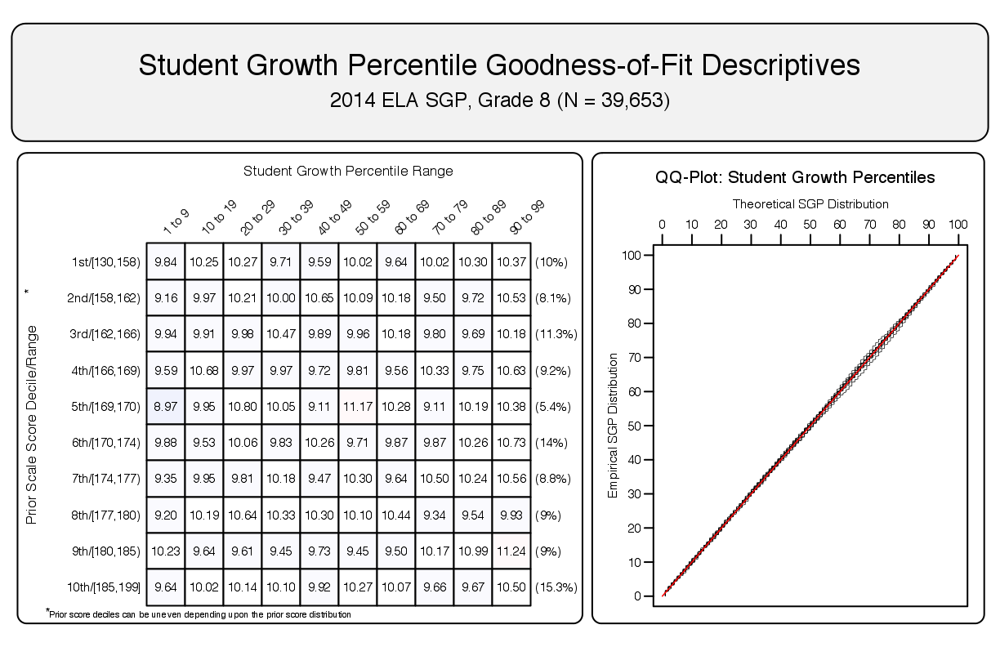

<!--SGPreport-->


<!-- 
This document was written by Damian Betebenner & Adam VanIwaarden for the Utah State Office of Education (USOE).

	Original Draft:  January 15, 2015
	Second Draft:    June 18, 2015
	...
-->

<!-- load some R packages and functions required for HTML table creation silently.  Load SGP and other packages here to avoid messages. -->

```{r, echo=FALSE, include=FALSE}
  ## set a universal Cache path
  knitr::opts_chunk$set(cache.path = "_cache/UT_SGP_2014")

  ##  Load some R packages and functions required for HTML table creation silently.  
  ##  Load SGP and other packages here to avoid messages.
  require(SGP)
	require(data.table)
	require(plyr)
	require(Gmisc)
  require(htmlTable)
  require(ztable)

  options(table_counter=FALSE)
  options(table_number=0)
  options("fig_caption_no"=0)
	options(fig_caption_no_sprintf = "**Figure %s:**   %s")
	options("fig_caption_no_roman"=FALSE)
	options("equation_counter" = 0)
																												
	subject_order<-c("ELA", "MATHEMATICS", "SCIENCE", 
									 "EARTH_SCIENCE", "BIOLOGY", "CHEMISTRY", "PHYSICS", "SEC_MATH_I", "SEC_MATH_II", "SEC_MATH_III")
	GL_subjects <- c("ELA", "MATHEMATICS", "SCIENCE")
	EOCT_subjects<-c("EARTH_SCIENCE", "BIOLOGY", "CHEMISTRY", "PHYSICS", "SEC_MATH_I", "SEC_MATH_II", "SEC_MATH_III")
```

# Introduction

This report contains details on the implementation of the student growth percentiles (SGP) model for the state of Utah. The National Center for the Improvement of Educational Assessment (NCIEA) contracted with the Utah State Office of Education (USOE) to implement the SGP methodology using data derived from the Utah student assessment program to create the Utah Student Growth Model. The goal of the engagement with USOE is to create a set of open source analytic techniques and conduct a set of initial analyses that will eventually be conducted by USOE in following years.

The SGP methodology is an open source norm- and criterion-referenced student growth analysis that produces student growth percentiles for each student with longitudinal data in the state. The methodology is currently used for many purposes. States and districts have used the results in various ways including parent/student diagnostic reporting, institutional improvement, and school and educator accountability. 

The report includes four sections covering Data, Analytics, SGP Results, and Goodness of Fit:

- *Data* includes details on the decision rules used in the raw data preparation and student record validation.
- *Analytics* introduces some of the basic methodological concepts implemented.
- *SGP Results* provides basic descriptive statistics from the 2014 analyses.
- *Goodness of Fit* describes how well the statistical models used to produce SGPs fit Utah students' data.  This includes discussion of goodness of fit plots and the student- and school level correlations between SGP and prior achievement.

Additionally, multiple appendices are included.  Appendix A includes Goodness of Fit plots for all content areas and grades.  Appendix B provides a more technical description of the SGP methodology and statistical concepts.  Appendix C is a report on the transition from the CRT assessments to the Utah Student Assessment of Growth and Excellence (SAGE) that addresses concerns about reported anomalies in the 2014 SGP results.

# Data

Data for the Utah Student Assessment of Growth and Excellence (SAGE) used in the SGP analyses were supplied by the Utah SOE to the NCIEA for analysis in the summer of 2014. The current longitudinal data set includes academic years 2007-2008 through 2013-2014. Subsequent years' analyses will augment this multi-year data set allowing USOE to maintain a comprehensive longitudinal data set for all students taking the SAGE and EOCT assessments.

Student Growth Percentiles have been produced for students that have a current score and at least one prior score in the same subject or a related content area.  SGPs were produced for English Language Arts (ELA), Science and Mathematics end-of-grade tests (EOGT).  For the 2014 academic year SGPs were produced for end-of-course tests (EOCT) for Earth Science, Biology, Chemistry, Physics, Secondary Math I, Secondary Math II and Secondary Math III courses.

## Longitudinal Data
Growth analyses on assessment data require data which are linked to individual students over time.  Student growth percentile analyses require, at a minimum, two years of assessment data for analysis of student progress.  To this end it is necessary that a unique student identifier be available so that student data records across years can be merged with one another and subsequently examined. Because some records in the assessment data set contain students with more than one test score in a content area in a given year, a process to create unique student records in each content area by year combination is required in order to carry out subsequent growth analyses.  The following business rules were used to select the appropriate record for use in the analyses.

### Student Record Selection Business Rules

1. Student records with missing ("NA") scores or scale scores outside of the possible range are invalidated.
2. If a student has multiple records (duplicate from the same subject and grade), the score associated with the most advance course is selected.
3. Students who are not enrolled in a school for the full academic year (FAY) are omitted.
4. Non-standard participation or accommodation students are omitted.

Table `r tblNumNext()` shows the number of valid grade level student records available for analysis^[This number does not represent the number of SGPs produced, however, because students are required to have at least one prior score available as well.] and Table `r tblNumNext()+1` shows the available number of valid EOCT records.


```{r, cache=TRUE, echo=FALSE, include=FALSE}
n_tbl <- table(Utah_SGP@Data[YEAR=='2014' & VALID_CASE=='VALID_CASE']$CONTENT_AREA, Utah_SGP@Data[YEAR=='2014' & VALID_CASE=='VALID_CASE']$GRADE)
```
```{r, results='asis', echo=FALSE, N_tableSAGE}
	n_tbl_SAGE <- n_tbl[rownames(n_tbl) %in% GL_subjects, -which(colnames(n_tbl)=="EOCT")]
	n_tbl_SAGE <- n_tbl_SAGE[match(GL_subjects, row.names(n_tbl_SAGE)) ,]
	n_tbl_SAGE <- cbind('Content Area'=sapply(GL_subjects, capwords, special.words=c("ELA")), n_tbl_SAGE)
	n_tbl_SAGE <- prettyNum(n_tbl_SAGE, preserve.width = "individual",big.mark=',')
	n_tbl_SAGE[which(n_tbl_SAGE==0)] <- ''
	n_tbl_SAGE <- n_tbl_SAGE[, match(c('Content Area', sort(as.numeric(colnames(n_tbl_SAGE)[-1]))), colnames(n_tbl_SAGE))]
	row.names(n_tbl_SAGE) <- NULL

  cat(dualTable(as.matrix(n_tbl_SAGE), align=paste(rep('r', dim(n_tbl_SAGE)[2]), collapse=''), 
		n.cgroup=c(1, dim(n_tbl_SAGE)[2]-1), cgroup=c("", "Grades"),
		caption='Number of Valid Grade Level Student Records by Grade and Subject for 2014'))

```

```{r, results='asis', echo=FALSE, N_tableEOCT}
	n_tbl_EOCT <- as.matrix(n_tbl[rownames(n_tbl) %in% EOCT_subjects, which(colnames(n_tbl)=="EOCT")], ncol=1)
	n_tbl_EOCT <- as.matrix(n_tbl_EOCT[match(EOCT_subjects, row.names(n_tbl_EOCT)) ,], ncol=1)
	n_tbl_EOCT <- cbind('Content Area'=sapply(EOCT_subjects, capwords, special.words=c("ELA", "II", "III")), 'Valid Records' = n_tbl_EOCT)
	n_tbl_EOCT <- prettyNum(n_tbl_EOCT, preserve.width = "individual",big.mark=',')
	row.names(n_tbl_EOCT) <- NULL

	cat(dualTable(as.matrix(n_tbl_EOCT), align=paste(rep('r', dim(n_tbl_EOCT)[2]), collapse=''), 
# 		n.cgroup=c(1, dim(n_tbl_EOCT)[2]-1), compatibility="CSS",
		caption='Total Number of Valid EOCT Student Records by Subject for 2014'))
```

# Analytics

Please see the [Github Utah Repository Wiki](https://github.com/CenterForAssessment/Utah/wiki) for information on the implementation of the open source software package [`SGP`](http://sgp.io/) [@sgp2014] developed for the [`R`](https://www.r-project.org/) software environment [@Rsoftware] by the National Center for the Improvement of Educational Assessment.


# SGP Results
The following sections provide basic descriptive statistics from the 2014 analyses, including the state level mean and median growth percentiles.  Currently Utah uses cohort referenced SGPs as the official student level growth metric.  The interested reader can find more in depth discussions of the SGP methodology in Appendix B of this report.

## Median SGPs
Growth percentiles, being quantities associated with each individual student, can be easily summarized across numerous grouping indicators to provide summary results regarding growth.  The median and mean of a collection of growth percentiles are used as measures of central tendency that summarize the distribution as a single number.  With perfect data fit, we expect the state median of all student growth percentiles in any grade to be 50 because the data are norm-referenced across all students in the state.  Median (and mean) growth percentiles well below 50 represent growth less than the state "average" and median growth percentiles well above 50 represent growth in excess of the state "average".

To demonstrate the norm-referenced nature of the growth percentiles viewed at the state level, Table `r tblNumNext()` presents the cohort-referenced growth percentile medians and means for the grade level content areas and `r tblNumNext()+1` shows the EOCT subjects.

```{r, cache=TRUE, echo=FALSE, include=FALSE}
	gl_sage_smry <- Utah_SGP@Data[CONTENT_AREA %in% GL_subjects & YEAR=='2014'][, list(MEDIAN = median(as.numeric(SGP), na.rm=TRUE), MEAN = round(mean(SGP, na.rm=TRUE), 1)), by=c('CONTENT_AREA', 'GRADE')][!is.na(MEDIAN)]
	gl_sage_smry [, GRADE := as.numeric(GRADE)]
	setkey(gl_sage_smry)
```
```{r, results='asis', echo=FALSE, sumTab_GL}
	gl_sage_smryB <- data.frame()
	for (ca in GL_subjects){
		tmp_gl_sage_smry <- paste(t(as.matrix(gl_sage_smry[CONTENT_AREA==ca,][, list(MEDIAN)])), " (", t(as.matrix(gl_sage_smry[CONTENT_AREA==ca,][, list(MEAN)])), ")", sep="")
		tmp_gl_sage_smry <- data.frame(matrix(c(capwords(ca), tmp_gl_sage_smry), 1, length(tmp_gl_sage_smry)+1), stringsAsFactors = FALSE)
		names(tmp_gl_sage_smry) <- c("Content Area", t(as.matrix(gl_sage_smry[CONTENT_AREA==ca,][, list(GRADE)])))
		gl_sage_smryB <- rbind.fill(gl_sage_smryB, tmp_gl_sage_smry)
	}
	gl_sage_smryB[is.na(gl_sage_smryB)] <- ""
	
  cat(dualTable(as.matrix(gl_sage_smryB), title="", align=paste(rep('r', dim(gl_sage_smryB)[2]), collapse=''), 
  	n.cgroup=c(1, dim(gl_sage_smryB)[2]-1), cgroup=c("", "Grades"),
		caption='Grade Level SAGE Median (Mean) Student Growth Percentile by Grade and Content Area for 2014'))
```

```{r, cache=TRUE, echo=FALSE, include=FALSE}
	eoct_sage_smry <- Utah_SGP@Data[CONTENT_AREA %in% EOCT_subjects & YEAR=='2014'][,list("Median SGP"=median(as.numeric(SGP), na.rm=TRUE), "Mean SGP"=round(mean(SGP, na.rm=TRUE), 1)), by='CONTENT_AREA']
	setkey(eoct_sage_smry)
```
```{r, results='asis', echo=FALSE, sumTabEOCT}
	eoct_sage_smry_B <- eoct_sage_smry[match(EOCT_subjects, eoct_sage_smry[["CONTENT_AREA"]]) ,]
	eoct_sage_smry_B <- eoct_sage_smry_B[, CONTENT_AREA := sapply(CONTENT_AREA, capwords, special.words=c("I", "II", "III"))]
	setnames(eoct_sage_smry_B, "CONTENT_AREA", "Content Area")

  cat(dualTable(as.matrix(eoct_sage_smry_B), title="", align='rcc', 
		caption='EOCT SAGE Median and Mean Student Growth Percentile by Content Area for 2014'))
```

Based upon perfect model fit to the data, the median of all state growth percentiles in each grade by year by subject combination should be 50.  That is, in the conditional distributions, 50 percent of growth percentiles should be less than 50 and 50 percent should be greater than 50.  Deviations from 50 indicate imperfect model fit to the data.  Imperfect model fit can occur for a number of reasons, some due to issues with the data (e.g., floor and ceiling effects leading to a "bunching" up of the data) as well as issues due to the way that the SGP function fits the data.  The results in Table `r tblNum()-1` and `r tblNum()` are close to perfect, with almost all values equal to 50.

The results are coarse in that they are aggregated across tens of thousands of students. More refined fit analyses are presented in the Goodness-of-Fit section that follows. Depending upon feedback from Utah SOE, it may be desirable to tweak with some operational parameters and attempt to improve fit even further. The impact upon the operational results based on better fit is expected to be extremely minor.

It is important to note how, at the entire state level, the *norm-referenced* growth information returns little information on annual trends due to its norm-reference nature. What the results indicate is that a typical (or average) student in the state demonstrates 50<sup>th</sup> percentile growth. That is, "typical students" demonstrate "typical growth". One benefit of the norm-referenced results follows when subgroups are examined (e.g., schools, district, demographic groups, etc.) Examining subgroups in terms of the median of their student growth percentiles, it is then possible to investigate why some subgroups display lower/higher student growth than others. Moreover, because the subgroup summary statistic (i.e., the median) is composed of many individual student growth percentiles, one can break out the result and further examine the distribution of individual results. 

# Goodness of Fit
Examination of goodness-of-fit was conducted by comparing the estimated conditional density with the theoretical uniform density of the SGPs.  Despite the use of B-splines to accommodate heteroscedasticity and skewness of the conditional density, assumptions are made concerning the number and position of spline knots that impact the percentile curves that are fit.  With an infinite population of test takers, at each prior scaled score, with perfect model fit, the expectation is to have 10 percent of the estimated growth percentiles between 1 and 9, 10 and 19, 20 and 29, ..., and 90 and 99.  Deviations from 10 percent would be indicative of lack of model fit.  


## Model Fit Plots
Using all available grade level and EOCT scores as the variables, estimation of student growth percentiles was conducted for each possible student (those with a current score and at least one prior score). Percentages of student growth percentiles between the 10<sup>th</sup>, 20<sup>th</sup>, 30<sup>th</sup>, 40<sup>th</sup>, 50<sup>th</sup>, 60<sup>th</sup>, 70<sup>th</sup>, 80<sup>th</sup>, and 90<sup>th</sup> percentiles were calculated based upon the decile of the prior year's scaled score (the total students in each for the analyses varies depending on grade and subject). Results for the B-spline parameterizations for all analyses are given in Appendix A. 

The results in all subjects are excellent with a few exceptions. Deviations from perfect fit are indicated by red and blue shading.  The further *above* 10 the darker the red, and the further *below* 10 the darker the blue. In instances where large deviations from 10 occur, the likely cause is that there is a mass point associated with certain scale scores that makes it impossible to "split" the score at a dividing point forcing a majority of the scores into an adjacent cell.  This occurs more often in lower grades where fewer prior scores are available (particularly in the lowest grade when only a single prior is available). This is the case with all large deviations observed in the Utah data. As an example, Figure `r getOption("fig_caption_no")+1` shows the results for 8<sup>th</sup> grade ELA.

```{r, cache=TRUE, echo=FALSE, include=FALSE, GOFplots}
  ##    Create goodness of fit plots for tech report example
	dir.create("../img", recursive=TRUE, showWarnings=FALSE)

  setwd("../img")

  dat <- data.table(Utah_SGP@SGP[['SGPercentiles']][['ELA.2014']])
	dat <- dat[grep("2014/ELA_8", SGP_NORM_GROUP),]
	dat[, VALID_CASE := 'VALID_CASE']
	dat[, GRADE := '8']
	dat[, YEAR := '2014']
	dat[, CONTENT_AREA := "ELA"]
	gofSGP(dat, state="UT", years='2014', content_areas="ELA", use.sgp="SGP", output.format="PNG")

	setwd("../2014")
```

##### `r figCapNo("Goodness of Fit Plot for 2014 8<sup>th</sup> Grade ELA.")`



<!-- HTML_Start -->
<!-- LaTeX_Start 
\pagebreak
LaTeX_End -->

## Student Level Results
To investigate the possibility that individual level misfit might impact summary level results, student growth percentile analyses were run on all students and the results were examined relative to prior achievement.  With perfect fit to data, the correlation between students' most recent prior achievement scores and their student growth percentiles is zero (i.e., the goodness of fit tables would have a uniform distribution of percentiles across all previous scale score levels).  To investigate in another way, correlations between prior student scale scores and student growth percentiles were calculated.^[In addition to providing information about model fit, these student level correlations can assess potential impact of test ceiling effects.]

Student level correlations between the SGP and prior achievement are presented here.  The results are generally as expected.  With cohort-referenced percentiles, when the model is perfectly fit to the data, the correlation between students' most recent prior achievement scores and their student growth percentiles is zero (i.e., there is a uniform distribution of percentiles across all previous scale score levels).  Correlations for Utah cohort-referenced SGPs are all essentially zero.  This provides assurance that the models have fit the data well, and indicate that students can demonstrate high (or low) growth regardless of prior achievement using cohort-referenced SGPs.


```{r, cache=TRUE, echo=FALSE, include=FALSE}
	student.cor.grd <- Utah_SGP@Data[YEAR=='2014' & VALID_CASE=='VALID_CASE'][, list(
		Correlation = round(cor(SGP, SCALE_SCORE_PRIOR_STANDARDIZED, use='pairwise.complete'), 2), 
		# N = sum(!is.na(SGP))), by = c('CONTENT_AREA')]
		N_Size = sum(!is.na(SGP))), by = c('CONTENT_AREA', 'GRADE')]

	gl_tmp_tbl <- student.cor.grd[CONTENT_AREA %in% GL_subjects][order(match(student.cor.grd$CONTENT_AREA, GL_subjects))][!is.na(Correlation)]
	gl_tmp_tbl[, GRADE := as.numeric(GRADE)]
	setkey(gl_tmp_tbl, CONTENT_AREA, GRADE)

```


```{r, results='asis', echo=FALSE, Student_SAGE}
	###  Number of "row groups" - breaking on Content areas.  
# 	n.row.group <- diff(c(match(GL_subjects, gl_tmp_tbl$CONTENT_AREA), dim(gl_tmp_tbl)[1]+1))
# 	row.group <- sapply(unique(gl_tmp_tbl$CONTENT_AREA), capwords, USE.NAMES=FALSE)
	tmp.cap <- "EOGT Student Level Correlations between Prior Standardized Scale Score and SGP"
	# gl_tmp_tbl <- data.frame(gl_tmp_tbl)[, -1]
	gl_tmp_tbl$CONTENT_AREA <- sapply(gl_tmp_tbl$CONTENT_AREA, capwords, USE.NAMES=FALSE)
	gl_tmp_tbl$CONTENT_AREA[duplicated(gl_tmp_tbl$CONTENT_AREA)] <- ""
	gl_tmp_tbl$N_Size <- prettyNum(gl_tmp_tbl$N_Size, preserve.width = "individual", big.mark=',')

	setnames(gl_tmp_tbl, sapply(names(gl_tmp_tbl), capwords))

  cat(dualTable(as.matrix(gl_tmp_tbl), align=paste(rep('r', dim(gl_tmp_tbl)[2]), collapse=''), caption = tmp.cap))
```

```{r, results='asis', echo=FALSE, Student_EOCTCohort}
	eoct_tmp_tbl <- data.frame(student.cor.grd[CONTENT_AREA %in% EOCT_subjects][!is.na(Correlation)])
	eoct_tmp_tbl$GRADE <- NULL
	eoct_tmp_tbl$CONTENT_AREA <- sapply(eoct_tmp_tbl$CONTENT_AREA, capwords)
	eoct_tmp_tbl$N_Size <- prettyNum(eoct_tmp_tbl$N_Size, preserve.width = "individual", big.mark=',')
	names(eoct_tmp_tbl) <- sapply(names(eoct_tmp_tbl), capwords)

	tmp.cap <- "EOCT Student Level Correlations between Prior Standardized Scale Score and SGP"

	cat(dualTable(as.matrix(eoct_tmp_tbl), align=paste(rep('r', dim(eoct_tmp_tbl)[2]), collapse=''), caption = tmp.cap))
```

## Group Level Results
Unlike when reporting SGPs at the individual level, when aggregating to the group level (e.g., school) the correlation between aggregate prior student achievement and aggregate growth is rarely zero. The correlation between prior student achievement and growth at the school level is a compelling descriptive statistic because it indicates whether students attending schools serving higher achieving students grow faster (on average) than those students attending schools serving lower achieving students. Results from previous state analyses show a correlation between prior achievement of students associated with a current school (quantified as percent at/above proficient) and the median SGP are typically between 0.1 and 0.3 (although higher numbers have been observed in some states as well). That is, these results indicate that on average, students attending schools serving lower achieving students tend to demonstrate less exemplary growth than those attending schools serving higher achieving students. Equivalently, based upon ordinary least squares (OLS) regression assumptions, the prior achievement level of students attending a school accounts for between 1 and 10 percent of the variability observed in student growth. There are no definitive numbers on what this correlation should be, but recent studies on value-added models show similar results [@MccaLock:2008].

### School Level Results
To illustrate these relationships visually, the bubble charts in Figures `r getOption("fig_caption_no")+1`, `r getOption("fig_caption_no")+2` and `r getOption("fig_caption_no")+3` depict growth as quantified by the median SGP of students at the school against achievement/status, quantified by percentage of student at/above proficient at the school^[Percent Prior Proficient in this case is determined by the percent of student's that scored in the Proficient or Advanced range of all student's that received a score.  This measure does not reflect student's that did not receive a score.]. The charts have been successful in helping to motivate the discussion of the two qualities: student achievement and student growth. Though the figures are not detailed enough to indicate strength of relationship between growth and achievement, they are suggestive and valuable for discussions with stakeholders who are being introduced to the growth model for the first time.

```{r, cache=TRUE, results='asis', echo=FALSE, include=FALSE, Bubble_Plots}
	visualizeSGP(Utah_SGP,
		plot.types="bubblePlot",
		bPlot.content_areas=c("ELA", "MATHEMATICS", "SCIENCE"),
		bPlot.years="2014",
		bPlot.output="PNG",
		bPlot.format="presentation",
		bPlot.folder="../img/Bubble_Plots")

```

##### `r figCapNo("School Level Bubble Plots for Utah:  ELA, 2013-2014.")`
.png)

<p></p>
<p></p>

##### `r figCapNo("School Level Bubble Plots for Utah:  Mathematics, 2013-2014.")`
.png)

<p></p>
<p></p>

##### `r figCapNo("School Level Bubble Plots for Utah:  Science, 2013-2014.")`
.png)


The relationship between average prior student achievement and median SGP observed for Georgia is relatively strong compared to some other states for which the Center has done SGP analyses.  Table `r tblNumNext()` shows correlations between prior achievement (measured as the mean prior standardized scale score as well as the percent at/above proficient at the school^[Percent Prior Proficient in this case is determined by the percent of student's that scored in the Proficient or Advanced range of all student's that received a score.  This measure does not reflect student's that did not receive a score but are included in the denominator of percent proficient.]).  All results shown here are for schools with 10 or more students.


```{r, cache=TRUE, echo=FALSE, include=FALSE}
	sch.msgp <- Utah_SGP@Summary$SCHOOL_NUMBER$SCHOOL_NUMBER__YEAR__SCHOOL_ENROLLMENT_STATUS[!is.na(SCHOOL_NUMBER) & MEDIAN_SGP_COUNT > 9]
	sch.msgp.subj <- Utah_SGP@Summary$SCHOOL_NUMBER$SCHOOL_NUMBER__CONTENT_AREA__YEAR__SCHOOL_ENROLLMENT_STATUS[!is.na(SCHOOL_NUMBER) & MEDIAN_SGP_COUNT > 9]#__
	sch.msgp.grd <- Utah_SGP@Summary$SCHOOL_NUMBER$SCHOOL_NUMBER__CONTENT_AREA__YEAR__GRADE__SCHOOL_ENROLLMENT_STATUS[YEAR == '2014' & !is.na(SCHOOL_NUMBER) & MEDIAN_SGP_COUNT > 9]
	sch.msgp.grd$CONTENT_AREA <- ordered(sch.msgp.grd$CONTENT_AREA, levels = c(GL_subjects, EOCT_subjects)) #___
	##  Combined subjects - School_Cor_Grand
	sch.cor <- sch.msgp[, list(
						MEDIAN_SGP = round(cor(MEDIAN_SGP, MEAN_SCALE_SCORE_PRIOR_STANDARDIZED), 2),
						MEAN_SGP=round(cor(MEAN_SGP, MEAN_SCALE_SCORE_PRIOR_STANDARDIZED), 2)), by = 'YEAR']
	##  Multiple year - School_SAGE_Correlations
	sch.cor.subj <- sch.msgp.subj[, list(
						MEDIAN_SGP = round(cor(MEDIAN_SGP, MEAN_SCALE_SCORE_PRIOR_STANDARDIZED), 2),
						MEAN_SGP = round(cor(MEAN_SGP, MEAN_SCALE_SCORE_PRIOR_STANDARDIZED), 2)), by = c('CONTENT_AREA', 'YEAR')]		
	## SAGE 2014 by grade - School_Grade_SAGE_Correlations
	sch.cor.grd <- sch.msgp.grd[, list(
							MEDIAN_SGP = round(cor(MEDIAN_SGP, MEAN_SCALE_SCORE_PRIOR_STANDARDIZED), 2),
							MEAN_SGP = round(cor(MEAN_SGP, MEAN_SCALE_SCORE_PRIOR_STANDARDIZED), 2)), by = c('CONTENT_AREA', 'GRADE')]
	sch.cor.grd <- sch.cor.grd[order(match(sch.cor.grd$CONTENT_AREA, c(GL_subjects, EOCT_subjects))),]

	gl_cor_tbl <- sch.cor.grd[CONTENT_AREA %in% GL_subjects]
	gl_cor_tbl[, GRADE := as.numeric(GRADE)]
	setkey(gl_cor_tbl, CONTENT_AREA, GRADE)

```

```{r, results='asis', echo=FALSE, School_Cor_Grand}
	tmp_tbl <- data.frame(sch.cor)
	tmp.cap <- "School Level Correlations between Mean Prior Standardized Scale Score and Aggregate SGPs - (Combined Subjects)"
	names(tmp_tbl) <- sapply(names(tmp_tbl), capwords)

  options("table_counter"=getOption("table_counter")-1)
	cat(dualTable(as.matrix(tmp_tbl), align=paste(rep('r', dim(tmp_tbl)[2]), collapse=''), caption  = tmp.cap))
```
<p></p>

Correlation tables describing the relationship between prior achievement (again defined as mean prior standardized scale score) and aggregate growth percentiles are presented below in separate subsections for grade level and EOCT subjects.  The first correlation table in the each subsection provides these overall SGP aggregates' relationships with mean prior standardized scale scores. The additional correlation tables are dis-aggregated by content area, and content area and grade to provide more detail.

<p></p>

```{r, results='asis', echo=FALSE, School_SAGE_Correlations}
	tmp_tbl <- sch.cor.subj[order(match(sch.cor.subj$CONTENT_AREA, GL_subjects)),][CONTENT_AREA %in% GL_subjects]
	###  Number of "row groups"
# 	n.row.group <- diff(c(match(GL_subjects, tmp_tbl$CONTENT_AREA), dim(tmp_tbl)[1]+1))
# 	row.group <- sapply(unique(tmp_tbl$CONTENT_AREA), capwords, USE.NAMES=FALSE)
	tmp.cap <- "School Level EOGT Correlations between Mean Prior Standardized Scale Score and SGP Aggregations."	
	# tmp_tbl$CONTENT_AREA <- NULL
	tmp_tbl$CONTENT_AREA <- sapply(tmp_tbl$CONTENT_AREA, capwords, USE.NAMES=FALSE)
	tmp_tbl$CONTENT_AREA[duplicated(tmp_tbl$CONTENT_AREA)] <- ""
	setnames(tmp_tbl, sapply(names(tmp_tbl), capwords))

	tmp_tbl[is.na(tmp_tbl)] <- ""

	cat(dualTable(as.matrix(tmp_tbl), align=paste(rep('r', dim(tmp_tbl)[2]), collapse=''), caption  = tmp.cap))
```


```{r, results='asis', echo=FALSE, School_Grade_SAGE_Correlations}
	###  Number of "row groups" - here I'm breaking on Content area.  
# 	n.row.group <- diff(c(match(GL_subjects, gl_cor_tbl$CONTENT_AREA), dim(gl_cor_tbl)[1]+1))
# 	row.group <- sapply(unique(gl_cor_tbl$CONTENT_AREA), capwords)
	tmp.cap <- "2014 School Level EOGT Correlations between Mean Prior Standardized Scale Score and Aggregate SGPs by Grade."
# 	gl_cor_tbl <- data.frame(gl_cor_tbl)[, -1]
# 	names(gl_cor_tbl) <- sapply(names(gl_cor_tbl), capwords)
	gl_cor_tbl$CONTENT_AREA <- sapply(gl_cor_tbl$CONTENT_AREA, capwords)
	gl_cor_tbl$CONTENT_AREA[duplicated(gl_cor_tbl$CONTENT_AREA)] <- ""
	setnames(gl_cor_tbl, sapply(names(gl_cor_tbl), capwords))

	cat(dualTable(as.matrix(gl_cor_tbl), align=paste(rep('r', dim(gl_cor_tbl)[2]), collapse=''), caption = tmp.cap))
```


```{r, results='asis', echo=FALSE, School_EOCT_Cor}
	tmp_tbl <- sch.cor.subj[order(match(sch.cor.subj$CONTENT_AREA, EOCT_subjects)),][CONTENT_AREA %in% EOCT_subjects]
	###  Number of "row groups" - none here.  
# 	n.row.group <- diff(c(match(EOCT_subjects, tmp_tbl$CONTENT_AREA), dim(tmp_tbl)[1]+1))
# 	row.group <- sapply(unique(tmp_tbl$CONTENT_AREA), capwords)
	tmp.cap <- "2012 to 2014 School Level EOCT Correlations between Mean Prior Standardized Scale Score and Aggregate SGPs."
# 	tmp_tbl$CONTENT_AREA <- NULL
# 	names(tmp_tbl) <- sapply(names(tmp_tbl), capwords)
	tmp_tbl$CONTENT_AREA <- sapply(tmp_tbl$CONTENT_AREA, capwords, USE.NAMES=FALSE)
	tmp_tbl$CONTENT_AREA[duplicated(tmp_tbl$CONTENT_AREA)] <- ""
	setnames(tmp_tbl, sapply(names(tmp_tbl), capwords))

	tmp_tbl[is.na(tmp_tbl)] <- ""

  options("table_counter"=getOption("table_counter")-1)
	cat(dualTable(as.matrix(tmp_tbl), align=paste(rep('r', dim(tmp_tbl)[2]), collapse=''), caption = tmp.cap))
```

<!-- HTML_Start -->
<!-- LaTeX_Start 
\pagebreak
LaTeX_End -->

# References
